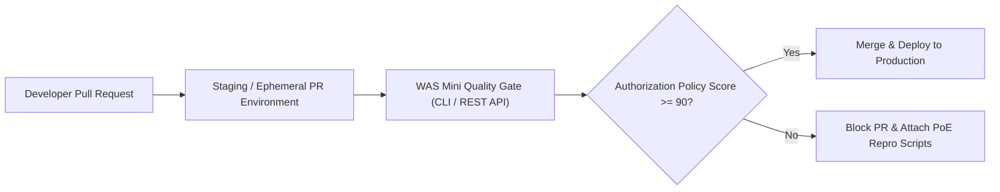

# 🌐 Real-World Applications of WAS Mini in Enterprise Web Application Security

---

## 1. The Industry Context: Why Authorization is AppSec's Hardest Problem

According to the **OWASP API Security Top 10 (2023)** and major cybersecurity threat reports, **Broken Object-Level Authorization (BOLA / IDOR)** and **Broken Function-Level Authorization (BFLA)** account for the majority of severe cloud data breaches (affecting companies like Uber, T-Mobile, Venmo, and Optus).

### Why Traditional Tools Miss These Flaws in Production:
1. **WAFs (Web Application Firewalls)** only inspect syntax anomalies (SQL syntax, `<script>` tags, directory traversal characters). A request like `GET /api/accounts/9821` is completely syntactically clean; a WAF has no contextual knowledge of whether User A is allowed to see Account 9821.
2. **Traditional DAST Tools (ZAP, Burp active scanner, Acunetix)** operate under a single authentication context. If an endpoint returns HTTP `200 OK` with valid JSON, single-role scanners assume the request was successful and proceed.
3. **SAST (Static Analysis)** scans source code without understanding runtime token payloads, database relationships, and claims verification in multi-tier microservices.

**WAS Mini as built can be deployed directly into real-world software engineering environments.** This document outlines how the platform is used in production DevSecOps, compliance auditing, and penetration testing workflows.

---

## 2. Real-World Use Case 1: Automated CI/CD DevSecOps Quality Gate

In modern continuous delivery pipelines, security teams strive to "shift left" — catching authorization flaws in pull requests before they reach production clusters.



### How WAS Mini Works in This Scenario:
1. When a developer submits a PR that touches API routing or database queries, GitHub Actions / GitLab CI spins up an ephemeral staging environment.
2. The CI pipeline invokes the WAS Mini scanner via its REST API (`POST /api/scans`) with the OpenAPI specification generated by the build.
3. Using the **⚡ Quick (~20s)** or **🎯 Standard (~1m)** profile, WAS Mini crawls the staging API under two test accounts (`tenant_alpha` and `tenant_beta`).
4. **Policy Gate Evaluation**:
   - The pipeline queries `GET /api/scans/{id}/policy-score`.
   - If `policy_score < 90` or any `CRITICAL` BOLA findings exist, the CI pipeline automatically **fails the build**.
5. **Actionable Feedback**: The pipeline downloads the generated **Proof-of-Exploit cURL command** and comments directly on the developer's pull request:
   > *"Build Blocked: PR introduces BOLA on `GET /api/orders/{id}`. Tenant Alpha was able to view Tenant Beta's order data. Run this command to reproduce locally: `curl -X GET ...`"*

---

## 3. Real-World Use Case 2: Multi-Tenant SaaS Isolation Auditing

Software-as-a-Service (SaaS) providers often store data for multiple corporate clients in shared database tables partitioned by a `company_id` or `tenant_id` column. A missing `WHERE company_id = ?` clause in an ORM query can cause catastrophic cross-tenant data leakage.

### How WAS Mini Secures Multi-Tenant SaaS:
1. **Canary Verification**: WAS Mini's **Autonomous Entity Lifecycle Engine (Pillar 2)** provisions canary objects tagged uniquely to Tenant Alpha.
2. **Cross-Tenant Probing**: It attempts to read, modify, and delete Tenant Alpha's canary records using the API tokens of Tenant Beta and Tenant Gamma.
3. **State Mutation Check**: In Deep mode, it actively checks whether Tenant Beta can alter Tenant Alpha's records (`PUT /api/workspaces/41/settings`) and confirms whether the change persisted in the database.
4. **Zero-Trace Teardown**: Upon completing the check cycle, the engine automatically deletes the provisioned canary objects, ensuring that testing leaves no artifacts in staging or pre-production databases.

---

## 4. Real-World Use Case 3: Compliance & Regulatory Governance

Enterprises operating in healthcare, finance, and e-commerce face strict legal mandates requiring formal proof of access control enforcement.

| Regulatory Standard | Mandate | How WAS Mini Fulfills It |
| :--- | :--- | :--- |
| **PCI-DSS 4.0** (Requirement 6.5.8) | Requires software development processes to prevent authorization bypass and Insecure Direct Object References (IDOR). | Generates **PDF / DOCX audit reports** proving that cross-user ID tampering returns HTTP 404/403 and yields a 0% data similarity delta. |
| **HIPAA Security Rule** (45 CFR § 164.312) | Requires technical policies that allow access to electronic protected health information (ePHI) only to authorized persons. | **Differential Analysis (Pillar 1)** inspects responses for sensitive PII/PHI patterns (patient names, phone numbers, addresses) and flags data leakage even if wrapped in generic error structures. |
| **SOC 2 Type II** (CC6.1, CC6.3) | Demands evidence that logical boundaries between tenants are continuously tested and monitored. | The **Access Control Matrix (ACM)** acts as a verifiable artifact proving role-to-resource separation across all endpoints. |
| **GDPR** (Article 32) | Requires technical measures to ensure a level of security appropriate to risk, including confidentiality of personal data. | Quantifiable **Authorization Health Index (0–100)** provides board-level security metrics tracking authorization posture over time. |

---

## 5. Real-World Use Case 4: Penetration Testing & Red Team Operations

Professional security consultants and internal penetration testers spend hours manually identifying IDORs in Burp Suite (swapping tokens between Repeater tabs, comparing response lengths).

### How Security Consultants Leverage WAS Mini:
1. **Automated Reconnaissance**: A consultant exports an OpenAPI spec or Postman collection from the target application and imports it into WAS Mini.
2. **Instant Policy Matrix**: Within 60 seconds, WAS Mini's **Access Control Matrix (ACM)** produces a complete heatmap showing which routes are vulnerable to cross-user access or missing authentication.
3. **Triage & Reporting**: The consultant uses the generated **Proof-of-Exploit (PoE)** scripts to verify findings instantly in a terminal without spending hours manually authoring proof-of-concept exploits.
4. **Client Delivery**: The consultant exports the executive **PDF report** containing the findings, similarity evidence diffs, OWASP classifications, and specific code-level remediation advice.

---

## 6. Real-World Use Case 5: Developer Self-Service & Automated Regression Testing

One of the greatest challenges for software developers is fixing an authorization bug and ensuring that future code changes do not accidentally reintroduce it.

### Converting WAS Mini Findings into Permanent Test Suites:
1. When WAS Mini detects a vulnerability, it automatically generates a standalone Python test script using the `requests` library:
   ```python
   # Generated by WAS Mini PoE Engine
   import requests
   resp = requests.get("https://api.example.com/api/orders/3", 
                       headers={"Authorization": f"Bearer {ATTACKER_TOKEN}"})
   assert resp.status_code in (401, 403, 404), "Regression: BOLA still active!"
   ```
2. Developers can copy this script directly from the dashboard with one click.
3. The script can be committed to the application's native test suite (e.g., `tests/security/test_bola_regressions.py`) as a permanent integration test.

---

## 7. Comparative Analysis: WAS Mini vs. Industry Tooling

| Feature / Capability | Conventional DAST (ZAP, Nikto) | Burp Suite Pro + Autorize | Commercial API Security (Salt, Noname) | **WAS Mini** |
| :--- | :--- | :--- | :--- | :--- |
| **BOLA / IDOR Detection** | ❌ Fails (flags 200 OK as safe) | ⚠️ Semi-Manual (requires browser proxying) | ✅ Good (inspects runtime network traffic) | ✅ **Automated & Differential** |
| **Autonomous ID Discovery** | ❌ None (manual entry only) | ❌ None (user must browse app) | ⚠️ Discovers from passive traffic | ✅ **Automated Crawling & Graph Discovery** |
| **Semantic Response Comparison** | ❌ Naive status code comparison | ⚠️ Basic byte length diff | ⚠️ AI anomaly detection | ✅ **Normalized Jaccard Structural Tree Scoring** |
| **State Mutation Verification** | ❌ None | ❌ Manual | ❌ Passive only | ✅ **Active Canary Tampering & Re-read Check** |
| **Access Control Matrix (ACM)** | ❌ None | ❌ None | ⚠️ Static role mapping | ✅ **Visual Heatmap with Anomaly Flagging** |
| **Automated Exploit Generation** | ❌ None | ❌ None | ❌ None | ✅ **cURL & Python Test Harness Generation** |
| **CI/CD Native & Headless** | ⚠️ Partial (CLI flags) | ❌ Heavy / desktop-first | ⚠️ Enterprise cloud agent required | ✅ **Lightweight, Zero-Config REST API** |

---

## 8. Summary: Value Proposition for Engineering Teams

By packaging **differential response analysis**, **autonomous resource provisioning**, **visual access control modeling**, and **reproducible proof-of-exploit generation** into an integrated platform, WAS Mini transforms authorization assessment from a manual, error-prone task into a continuous, deterministic security engineering process.
